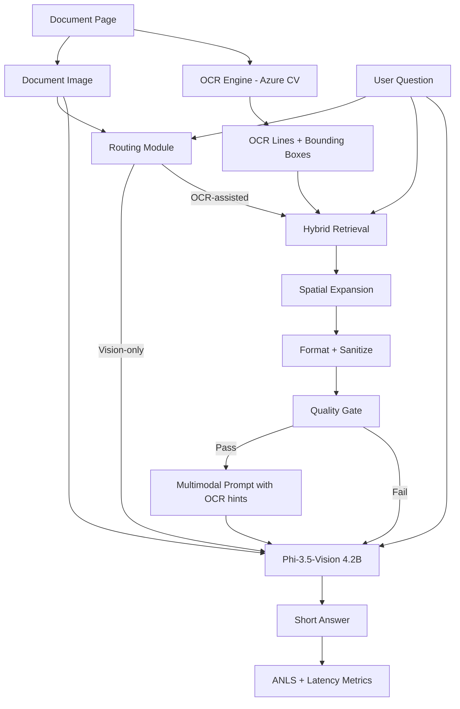
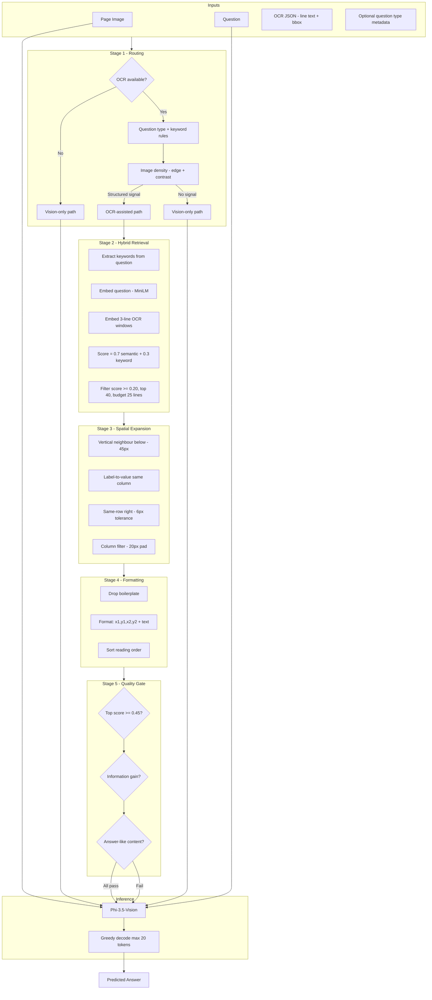

# Complete Interview Preparation Handbook

## SmallTalk Docs — Guiding sLLMs through Documents with OCR-Infused Prompts

**Candidate:** Mokshita Kochhar | IIT Kharagpur Research Intern | Phi-3.5-Vision (4.2B) on DocVQA

**Headline result (memorize):** Vision-only ANLS **0.506** → OCR-adaptive ANLS **0.658** (+0.152) on 200 paired SP-DocVQA samples. Layout-heavy +0.202, visual-heavy +0.102. Adaptive wins 46 vs baseline 6 (148 ties).

---

# SECTION 1: PROJECT STORY

## 1. What is this project?

### 30-second explanation (speak exactly like this)

> "I worked on SmallTalk Docs at IIT Kharagpur, where we study whether small vision-language models — specifically Phi-3.5-Vision at 4.2 billion parameters — can reliably answer questions over real documents. My contribution was building an adaptive OCR-infused prompting pipeline: instead of always giving the model OCR text or never giving it, we selectively inject extracted text with bounding-box coordinates into the multimodal prompt when the document and question look structured. On a 200-sample DocVQA evaluation, this improved mean ANLS from 0.506 to 0.658 without any fine-tuning — purely through better inference-time design."

### 2-minute explanation

> "Document QA is hard for small VLMs because a single page can have hundreds of text regions — forms, tables, fine print — and a 4B model has limited capacity to both *see* the layout and *read* precise field values. Our baseline was zero-shot Phi-3.5-Vision: image plus question, nothing else. That got mean ANLS around 0.506 on our evaluation subset.
>
> My hypothesis was that OCR shouldn't replace vision — the model should still look at the image — but targeted OCR *hints* could reduce field-selection errors on structured documents. So I built a five-stage adaptive pipeline: routing decides whether OCR is worth trying; hybrid retrieval picks relevant OCR lines using both keywords and semantic similarity; spatial expansion adds neighbouring lines when a label is found but the value is on the next line; a formatter cleans and orders text with coordinates; and a quality gate rejects weak snippets so we fall back to vision-only rather than injecting noise.
>
> Critically, the VLM always generates the final answer — we never return OCR directly. When the gate passes, we get +0.152 mean ANLS overall, with the biggest gain on layout-heavy questions (+0.202). We also measured inference latency because the trade-off matters for deployment: OCR preprocessing adds CPU cost, but the GPU VLM step still dominates. The research question is practical: can we make sub-5B models usable for enterprise document workflows without GPT-4V cost?"

### 5-minute explanation

> "The project sits at the intersection of SLM deployment and document AI. Enterprises have invoices, insurance forms, KYC documents — high volume, privacy-sensitive, latency-sensitive. GPT-4V is strong but expensive, slower, and often can't run on-prem. Phi-3.5-Vision is a 4.2B multimodal model that can run on a single GPU, which makes it interesting for applied research.
>
> We evaluated on SP-DocVQA — single-page document images with natural-language questions and multiple acceptable answers. I used ANLS, the standard DocVQA metric, because exact match is too harsh for real documents where '8/25/88' vs 'August 25, 1988' might both be valid.
>
> Phase 1 was vision-only baseline: image + question → Phi-3.5 → short answer. Failures clustered on forms and tables — wrong field selected, boilerplate copied, handwritten digits misread. Phase 2 was OCR-adaptive prompting. Azure OCR gives us line-level text with bounding boxes. The insight from V1 to V2 was that *always* injecting OCR hurts visual questions and noisy retrieval; *adaptive* injection with a quality gate is safer.
>
> The routing module uses three signals: question type when available, layout keywords in the question ('table', 'field', 'row'), and pixel-level page density via edge detection for dense forms the question doesn't explicitly mention. If routing selects OCR, hybrid retrieval blends 70% semantic similarity — MiniLM embeddings on three-line context windows — with 30% keyword matching. Spatial expansion handles the classic form pattern: label on one line, value below. The quality gate requires top retrieval confidence ≥ 0.45, information gain over the question, and answer-like content for 'what is' questions.
>
> Results on 200 stratified samples — 100 layout-heavy, 100 visual-heavy: mean ANLS 0.658 vs 0.506 baseline. Layout-heavy 0.770 vs 0.568. We won 46 head-to-head samples, lost 6, tied 148 — so improvement is real but concentrated where OCR helps. I can also discuss failure cases honestly: on one date question, bad OCR caused the model to copy '8/25/15' instead of the correct '8/25/88' — the gate checks confidence, not OCR truth.
>
> Why this matters for industry: it shows inference-time architecture — routing, retrieval, gating — can unlock meaningful gains on SLMs without fine-tuning. That's the deployment sweet spot: faster iteration, lower cost, easier rollback than retraining."

---

## 2. What problem does it solve?

**Problem:** Small VLMs struggle to extract precise answers from structured documents when many similar text regions exist on one page.

**Your solution:** Selective OCR-infused multimodal prompting that gives the model *where* (bounding boxes) and *what text* (OCR lines) is likely relevant — without removing the image.

**Who cares:** Insurance claims, loan KYC, invoice processing, contact-center document lookup — anywhere you need cheap, private, low-latency document QA.

---

## 3. Why is document understanding difficult?

| Challenge | Why it hurts |
|-----------|--------------|
| **Layout complexity** | Forms have multi-column grids; answer depends on spatial relation to labels |
| **Fine print & scans** | Low resolution, skew, faded ink — vision and OCR both degrade |
| **Long-tail vocabulary** | Names, IDs, medical terms not in pretraining distribution |
| **Boilerplate noise** | Headers, instructions, footers look like answers |
| **Multi-answer validity** | Same fact, many string forms — metrics must handle normalization |
| **Handwriting** | OCR errors propagate; SLMs have weaker error correction than large models |

---

## 4. Why do small models struggle with document reasoning?

1. **Limited capacity** — 4B params must jointly encode image patches, language, and reasoning; large models allocate more representational budget.
2. **Weaker visual grounding** — small VLMs misalign text regions under clutter.
3. **Short generation budget** — DocVQA needs terse exact spans; small models drift into sentences or boilerplate.
4. **No document-specific pretraining** — Phi-3.5-Vision is general multimodal, not trained on millions of form layouts.
5. **Attention dilution** — full-page images contain thousands of visual tokens; salient field is easy to miss.

**Your research angle:** Instead of scaling parameters, you **structured the input** (OCR hints + coordinates + routing) to reduce the search space.

---

## 5. Why not simply use GPT-4V?

**Strong interview answer:**

> "GPT-4V is an excellent upper bound, but it doesn't solve the deployment problem our project targets. For enterprise document pipelines you care about cost per page, latency P99, data residency, and running on-prem on a T4 or A10. A 4B model with smart prompting can process documents at a fraction of the cost with acceptable accuracy on structured subsets. Our +0.152 ANLS gain on Phi-3.5 without fine-tuning shows there's headroom in *system design*, not just model size. In production I'd use GPT-4V for hard cases — routing low-confidence samples to a larger model is a natural extension."

**Points to hit:**
- Cost: API pricing × volume
- Latency: network + larger model
- Privacy: PHI/PII can't leave VPC
- Control: prompt pipeline vs black-box API
- Hybrid: SLM first, LLM fallback

---

## 6. Why is this research important?

- **SLM era:** Industry is shifting from "biggest model wins" to "good enough at 1/10th cost."
- **Documents are the killer app for enterprise GenAI** — RAG on PDFs alone fails on scanned forms.
- **Inference-time compute is underrated** — routing + retrieval + gating is cheaper than fine-tuning cycles.
- **Honest benchmarking** — paired comparison, cohort stratification, failure analysis builds trust.
- **Bridges OCR and VLMs** — neither alone is sufficient; fusion architecture matters.

---

# SECTION 2: FULL ARCHITECTURE

## High-Level Architecture



## Detailed Architecture (V2 Adaptive Path)



## End-to-End Data Flow

| Step | Component | Input | Output | Purpose |
|------|-----------|-------|--------|---------|
| 1 | Document ingest | PDF/page scan | PNG image | Standardize for VLM + OCR |
| 2 | OCR (Azure CV) | Image | Lines with `[x1,y1,x2,y2]` + text | Machine-readable layout |
| 3 | Routing | Image, question, metadata | OCR path or vision-only | Avoid harmful OCR injection |
| 4 | Hybrid retrieval | Question, all OCR lines | Top-K relevant lines (≤25) | Shrink prompt to salient regions |
| 5 | Spatial expansion | Retrieved anchors, all lines | Anchors + neighbour values | Connect labels to answers |
| 6 | Formatting | Expanded lines | Clean coordinate-ordered snippet | Readable multimodal context |
| 7 | Quality gate | Snippet, scores, question | Pass/fail | Safety before prompt injection |
| 8 | Prompt construction | Image + question + optional snippet | Multimodal prompt | Fuse modalities |
| 9 | Phi-3.5-Vision | Prompt + image | Token logits | Generate answer span |
| 10 | Post-process | Raw generation | Trimmed short answer | Match DocVQA format |
| 11 | Evaluation | Prediction, ground truths | ANLS, exact match, latency | Benchmark |

**Baseline path:** Steps 1 → 8 (image + question only) → 9 → 10 → 11.

---

# SECTION 3: DEEP COMPONENT EXPLANATIONS

## Phi-3.5-Vision

| | |
|--|--|
| **What** | Microsoft's 4.2B instruction-tuned multimodal model; processes image + text jointly |
| **Why exists** | Bring VLM capability to edge/single-GPU deployment |
| **How** | Image encoded to visual tokens; fused with text tokens in transformer; autoregressive decode |
| **Why here** | Sub-5B SLM case study; runs on T4; no fine-tune budget |
| **Alternatives** | LLaVA, Qwen-VL, GPT-4V, Claude 3, Gemini Pro Vision |
| **Tradeoffs** | Cheaper/faster vs weaker document grounding; good for research on *system* improvements |

## Vision Language Models (VLMs)

| | |
|--|--|
| **What** | Models accepting image + text, producing text |
| **Why** | Documents are inherently multimodal — layout is visual, answers are textual |
| **How** | Vision encoder + LLM backbone + projection layer |
| **Why here** | DocVQA requires cross-modal reasoning |
| **Alternatives** | OCR → pure LLM (no image); layout LM (LayoutLMv3) |
| **Tradeoffs** | VLMs handle varied layouts; OCR-only loses diagrams/handwriting context |

## Multimodal Models

| | |
|--|--|
| **What** | Models trained on multiple modalities (vision, text, audio) |
| **Why** | Real-world inputs aren't text-only |
| **How** | Shared representation space or cross-attention |
| **Why here** | You inject OCR *into* multimodal prompt — second modality channel |
| **Alternatives** | Late fusion (separate models) |
| **Tradeoffs** | Early fusion (your approach) lets model reconcile OCR vs image discrepancies |

## SLMs vs LLMs

| | SLM (<5B) | LLM (>70B) / GPT-4 class |
|--|-----------|--------------------------|
| **Params** | Phi-3.5-Vision 4.2B | GPT-4V ~unknown, Llama-70B+ |
| **Cost** | Low GPU, on-prem | API $$$ |
| **Latency** | Seconds on T4 | Network + slower |
| **Doc accuracy** | Needs help (your pipeline) | Stronger zero-shot |
| **Privacy** | Air-gapped deploy | Data egress |

## OCR

| | |
|--|--|
| **What** | Optical Character Recognition — image → text + layout |
| **Why** | Gives exact character sequences SLMs misread from pixels |
| **How** | Azure CV returns lines with polygon/bbox coordinates |
| **Why here** | Pre-extracted for reproducibility; enterprise would use same OCR stack |
| **Alternatives** | Tesseract, PaddleOCR, Google Document AI, AWS Textract |
| **Tradeoffs** | Azure: strong layout, cost; errors on handwriting propagate |

## DocVQA

| | |
|--|--|
| **What** | Task: answer questions about document images |
| **Why** | Standard benchmark; SP-DocVQA adds single-page focus |
| **How** | (image, question) → answer span; multiple GT answers |
| **Why here** | Matches enterprise single-page workflows (invoice page, form page) |
| **Alternatives** | MP-DocVQA (multi-page), ChartQA, InfographicVQA |
| **Tradeoffs** | Single-page easier; real apps need multi-page extension |

## ANLS

| | |
|--|--|
| **What** | Average Normalized Levenshtein Similarity — DocVQA standard metric |
| **Why** | Partial credit for near-matches; exact match too brittle |
| **How** | Normalize strings → edit distance → if similarity < 0.5 then 0 else scale to [0,1] |
| **Why here** | Comparable to published DocVQA work |
| **Alternatives** | Exact match, F1 token, BLEU |
| **Tradeoffs** | ANLS ignores semantic equivalence ("USA" vs "United States" scores low) |

## Bounding Boxes

| | |
|--|--|
| **What** | Rectangle `[x1,y1,x2,y2]` locating text on page |
| **Why** | Preserves spatial layout in prompt — model knows *where* text appears |
| **How** | Azure polygon → axis-aligned bbox; included in each OCR line in prompt |
| **Why here** | Enables spatial expansion rules; helps disambiguate duplicate labels |
| **Alternatives** | Pure text OCR without coords; layout graphs |
| **Tradeoffs** | Coords add tokens; misaligned OCR boxes hurt expansion |

## Spatial Layout Understanding

| | |
|--|--|
| **What** | Reasoning about where information sits relative to labels |
| **Why** | Form answers are geometrically adjacent to labels, not semantic neighbors in text |
| **How** | Your expansion rules: below, same-row-right, column-filtered |
| **Why here** | Retrieval finds "Specimen:"; expansion finds "10 rat sera" below |
| **Alternatives** | LayoutLM pretraining; table transformers |
| **Tradeoffs** | Rule-based expansion is interpretable but brittle on exotic layouts |

## Prompt Engineering

| | |
|--|--|
| **What** | Designing input text to steer model behaviour without weight updates |
| **Why** | Fast iteration; no GPU training cluster |
| **How** | Instructions + OCR XML block + short-answer constraint + stop tokens |
| **Why here** | +0.152 ANLS with frozen weights |
| **Alternatives** | Fine-tuning, RLHF |
| **Tradeoffs** | Ceiling lower than fine-tune; but zero retraining risk |

## Multimodal Prompting

| | |
|--|--|
| **What** | Constructing prompts with both image tokens and text context |
| **Why** | SLM must receive OCR as *supplement*, not replacement |
| **How** | Image token always present; optional OCR context block with disclaimer |
| **Why here** | Disclaimer reduces blind OCR trust: "prefer image if hints lack answer" |
| **Alternatives** | OCR-only to LLM (drop image) |
| **Tradeoffs** | Longer prompts = more latency/memory |

---

# SECTION 4: SLM THEORY

## What is an SLM?

**Small Language Model** — typically **<5–8B parameters**, designed for efficient inference on consumer/edge GPU or CPU. This project uses **Phi-3.5-Vision at 4.2B** as the canonical SLM.

## What qualifies as an SLM?

| Tier | Params | Examples |
|------|--------|----------|
| Tiny | <1B | Phi-2, Gemma-2B |
| Small | 1–8B | **Phi-3.5-Vision 4.2B**, Llama-3.2-3B |
| Medium | 8–30B | Llama-3.1-8B/70B boundary |
| Large | 70B+ | GPT-4 class |

## Advantages of SLMs

- **Cost:** Single T4/A10 vs multi-GPU cluster
- **Latency:** No API round-trip; batch on-prem
- **Privacy:** Data never leaves enterprise VPC
- **Customization:** Fine-tune LoRA on company docs affordably
- **Determinism:** Greedy decode, controlled prompts

## Limitations of SLMs

- Weaker zero-shot reasoning and visual grounding
- Smaller context effective use — long OCR snippets hurt
- More sensitive to prompt phrasing
- Higher hallucination rate on rare entities

## Why enterprises adopt SLMs

- **Unit economics:** 1M pages/month at API cost breaks budgets
- **Compliance:** BFSI, healthcare, gov require on-prem
- **Latency SLAs:** Contact centers need <3s P95
- **Specialization:** Fine-tuned 4B on invoices beats generic 70B

## Phi-3.5-Vision case study (interview answer)

> "Phi-3.5-Vision at 4.2B is small enough to run float16 on a T4 with gradient checkpointing, yet multimodal — so it's a realistic enterprise SLM. Alone it got 0.506 mean ANLS on our subset. With adaptive OCR prompting, 0.658 — a 30% relative lift. That tells me the model had latent capability blocked by input formatting, not that we need 100B params for every document task."

## SLM vs LLM tradeoffs

| Dimension | SLM | LLM |
|-----------|-----|-----|
| Accuracy (zero-shot doc) | Lower | Higher |
| Fine-tune cost | $ | $$$ |
| Inference cost/page | Cents → fractions | Cents → dollars (API) |
| Latency | 1–5s GPU | 2–15s+ |
| Memory | 8–16 GB | 40–80+ GB |
| Deployment | Docker on-prem | API or big cluster |

---

# SECTION 5: MODEL EVALUATION

## Why ANLS?

- DocVQA answers vary: "100.00" vs "$100.00" vs "100"
- Exact match gives zero credit for close answers
- ANLS is the **community standard** — reviewers expect it
- Threshold at 0.5 similarity prevents gaming with garbage partial matches

## Why accuracy alone is insufficient

- **Exact match** ignores normalization (case, articles)
- **Accuracy** doesn't capture partial correctness on dates/IDs
- Need **cohort breakdown** — overall average hides layout vs visual split
- Need **paired comparison** — same 200 questions both modes
- Need **win/tie/loss** — 46 wins vs 6 losses shows directionality

## DocVQA metrics landscape

| Metric | Use |
|--------|-----|
| ANLS | Primary — headline result |
| Exact match | Secondary — 0.42 → 0.595 |
| Per-question-type | form +0.187, table/list +0.395 |
| Routing breakdown ANLS | Where pipeline activates |

## Latency measurements (how to speak about it)

> "We benchmarked end-to-end inference latency, not just model forward pass. The VLM forward pass dominates on GPU — typically a few seconds on T4 in float16. The OCR-adaptive path adds CPU-side overhead: retrieval embedding, spatial expansion, formatting — usually sub-second per page if OCR is pre-cached. For production I'd precompute OCR at ingest, cache MiniLM embeddings per document, and batch GPU requests. The dashboard compared vision-only vs vision+OCR side-by-side so we could see accuracy-latency trade-offs live."

## Throughput

- Bottleneck: VLM autoregressive decode
- Improve: batch inference, vLLM/TensorRT, shorter max tokens (20)
- OCR path: parallelize retrieval across workers; cache embeddings

## Inference cost

```
Cost/page ≈ (GPU_hour_rate × latency_hours) + OCR_API_cost
```

SLM on owned GPU → dominated by amortized hardware. GPT-4V → per-token API.

## Hallucination analysis

**Types observed:**
1. **Boilerplate copy** — "INSTRUCTION FOR USER" (fixed by sanitizer)
2. **Wrong field** — similar labels on page (OCR hints help)
3. **OCR trust failure** — model copies bad OCR date (gate doesn't check GT)
4. **Fabrication** — when neither image nor OCR has answer

---

### Evaluation Q&A

**Q: Why 200 samples not full val set?**  
A: Stratified 200 for paired ablation with manual inspection; full val is ~5K — planned scale-up; 200 gives stable paired comparison with seed 42.

**Q: Statistical significance?**  
A: 46 vs 6 wins is directional; I'd run bootstrap CI on mean ANLS delta for publication; for internship prototype the effect size (+0.152) is large enough to be meaningful.

**Q: Why paired comparison?**  
A: Same questions both modes — controls for question difficulty variance.

---

# SECTION 6: OCR-INFUSED PROMPTING

## Why OCR helps (on structured docs)

- Provides **exact character sequences** for field values
- Reduces **visual search space** — model doesn't scan entire page
- **Disambiguates** duplicate-looking regions via coordinates
- Helps **fine print** where vision encoder loses detail

## Why OCR doesn't always help

- Figure/diagram questions — OCR text irrelevant
- Bad retrieval — noise misleads model (date failure case)
- Handwriting OCR errors — model copies wrong year
- 148 ties — many questions unchanged either way

## What information OCR provides

1. Line-level text content
2. Bounding box coordinates
3. Implicit reading order (via y/x sort)
4. Field label patterns ("Specimen:", "Date:")

## Why bounding boxes matter

> "Without coordinates, OCR is a bag of words — the model can't tell which 'Date:' field you mean on a multi-section form. Coordinates make spatial layout explicit and power our expansion rules."

## Spatial reasoning challenges

- Multi-column forms — neighbour in wrong column
- Skewed scans — bbox misalignment breaks row detection (6px tolerance)
- Label/value split across lines — retrieval alone insufficient
- Handwritten values — OCR gap between label (printed) and value (script)

## Failure cases (know these cold)

| Case | What happened | Lesson |
|------|---------------|--------|
| Date question | OCR "8/25/15", GT "8/25/88" | Gate checks confidence not correctness |
| Eastern Airlines | Low retrieval score, gate failed, vision got ANLS 1.0 | Fallback saved accuracy |
| College question | Label split across OCR lines | Spatial expansion limits |
| Boilerplate | Model copied instructions | Sanitizer denylist |

## Prompt design decisions

1. **Always include image** — OCR is hints only
2. **Disclaimer** — "prefer image if hints incomplete"
3. **Short answer instruction** — reduces sentence drift
4. **Max 20 tokens** — DocVQA answers are spans
5. **Stop strings** — prevent runaway into new sections
6. **Bounded OCR block** — 25 lines, 1200 chars max
7. **XML wrapper** — clear separation of OCR context

## Likely follow-ups

**Q: Why not put full page OCR in prompt?**  
A: Attention dilution, latency, cost, noise. Selective retrieval is the whole point.

**Q: Why hybrid retrieval not pure RAG?**  
A: Field names need exact keyword match; semantic alone misses "college" → "College:" label.

**Q: Why quality gate after retrieval?**  
A: Router says "maybe OCR helps"; gate says "this snippet is actually good."

**Q: Did you try always-OCR?**  
A: V1 did; adaptive V2 improved by not injecting on visual questions and gating weak matches.

---

# SECTION 7: FINE-TUNING SECTION

## "If OCR prompting works, why not fine-tune?"

**Master answer:**

> "Prompt engineering gave us +0.152 ANLS with zero retraining risk and instant rollback — that's the right first step for deployment. Fine-tuning could push further but costs data labeling, GPU weeks, and risks catastrophic forgetting on general vision tasks. I'd fine-tune when: (1) we have 10K+ domain-specific QA pairs, (2) prompt ceiling is hit on in-domain docs, (3) latency budget allows LoRA merge. For the internship, we established that input architecture matters before committing to weight updates."

## Prompt Engineering vs Fine-Tuning

| | Prompt Eng | Fine-Tuning |
|--|------------|-------------|
| Data needed | None/minimal | Thousands+ pairs |
| Iteration | Hours | Days/weeks |
| Rollback | Change prompt | Redeploy weights |
| Ceiling | Moderate | Higher |
| Risk | Low | Overfit, forget |

## RAG vs Fine-Tuning

- OCR retrieval is a form of retrieval-augmented generation at inference
- RAG: retrieve external knowledge per query
- This project: retrieve OCR lines per question — **no weight update**

## PEFT methods

| Method | What |
|--------|------|
| **Full FT** | Update all weights |
| **LoRA** | Low-rank adapters on attention layers |
| **QLoRA** | LoRA + 4-bit quantized base |
| **PEFT** | Umbrella for adapter methods |
| **Instruction tuning** | FT on (instruction, input, output) tuples |

## How to fine-tune Phi-3.5-Vision (project-specific)

### 1. How to fine-tune

- Use **QLoRA** on language layers; optionally unfreeze vision projector
- Framework: HuggingFace TRL + PEFT
- Train on `(image, question, optional OCR context) → short answer`

### 2. Dataset needed

- **10K–50K** (image, question, answer) triples minimum for LoRA
- Include layout-heavy oversampling (forms, tables)
- Multiple acceptable answers per question

### 3. Data collection

- SP-DocVQA train (~39K QA pairs) as base
- Augment with enterprise-like docs: invoices, insurance forms
- Mine failure cases from 200 eval

### 4. Labeling

- DocVQA already has GT answers
- For enterprise: annotators draw bounding box + answer span
- Inter-annotator agreement on ambiguous fields

### 5. Training format

```json
{
  "image": "page.png",
  "conversations": [
    {"role": "user", "content": "<image>\nQuestion: What is the specimen?\n<ocr_context>[440,805,753,837] Specimen:\n[445,842,620,870] 10 rat sera</ocr_context>"},
    {"role": "assistant", "content": "10 rat sera"}
  ]
}
```

### 6. Hardware

- **Minimum:** 1× A100 40GB or 2× A10 24GB
- QLoRA 4-bit: fits 4B VLM on single 24GB with gradient checkpointing

### 7. Evaluation metrics

- Primary: **ANLS** on held-out val
- Must beat prompt-only V2 (0.658) to justify cost

### 8. How you'd know it worked

- ANLS lift > prompt ceiling (+0.05 absolute minimum)
- Win rate vs V2 prompt pipeline increases
- Failure cases decrease on layout cohort

### 9. Overfitting risks

- Memorizing train document IDs
- Learning OCR errors as GT
- **Mitigation:** early stopping, val ANLS monitoring, mix general VQA data

### 10. Expected improvements

- Realistic: +0.03–0.08 ANLS over strong prompt pipeline
- Diminishing returns if OCR pipeline already provides GT-like hints

---

# SECTION 8: DATASET CREATION

**Q: How would you create a dataset for document reasoning?**

### Data collection

- Scan diverse templates: invoices, tax forms, medical intake, insurance claims
- Vary DPI, skew, handwriting, stamps, redactions

### Data cleaning

- De-duplicate near-identical pages
- Remove PII or synthetic-replace (names, SSN)
- Filter unreadable pages (blur detection)

### Annotation

- Question writers per document type
- Answer span + acceptable variants
- Question type tags (form, table, figure)
- Optional: bounding box of answer region

### Synthetic data generation

- HTML → PDF form templates with programmatic GT
- Render with random fonts/noise (scanner simulation)
- **Pitfall:** domain gap to real scans — always mix real

### OCR augmentation

- Store OCR output alongside image
- Inject OCR errors deliberately for robustness training
- Cache bboxes for expansion rule training

### Validation

- Stratified split by document template, not random page
- Hold out entire form families unseen in train
- Report ANLS by template type

---

# SECTION 9: ENTERPRISE AI QUESTIONS

## Document assistant for insurance

> "I'd build a tiered pipeline: ingest PDFs → OCR at upload → index metadata → for each claim question, run our adaptive router. Form fields go OCR-assisted; damage photos go vision-only. Quality gate prevents low-confidence snippets. Human review queue for gate failures. Phi-3.5 on-prem for cost; escalate to larger model on low confidence."

## Ingesting company documents

1. Upload → virus scan → OCR async job
2. Store: image, OCR JSON, embedding cache
3. Chunk by page (not arbitrary text chunks for forms)
4. Metadata: doc type, effective date, customer ID
5. Access control per tenant

## Enterprise document QA system

```
Ingest → OCR → Index
         ↓
User question → Router → Retrieve → Expand → Gate → SLM → Answer + citations (bbox)
         ↓
Monitor: ANLS on golden set, latency P95, escalation rate
```

## Improve latency

- Precompute OCR at ingest
- Cache MiniLM embeddings per page
- GPU batching with vLLM
- Max 20 tokens decode
- Skip expansion on high-confidence direct matches

## Reduce cost

- SLM on owned GPU vs API
- Adaptive OCR — skip retrieval when router selects vision-only
- Quantization (FP16/INT8)
- Cache repeated documents

## When SLM instead of GPT-4?

| Use SLM | Use GPT-4 |
|---------|-----------|
| High volume forms | Complex multi-page reasoning |
| On-prem compliance | Cold-start zero-shot critical |
| Latency < 3s | Accuracy > all else |
| Domain fine-tuned | Novel layout never seen |
| Cost <$0.001/page | Budget allows $0.01+/page |

---

# SECTION 10: 50 AGGRESSIVE INTERVIEW QUESTIONS

Format: **Q → Ideal Answer → Why asked → Bad answer**

---

### SLM Research (1–8)

**1. Why study SLMs when GPT-4V exists?**  
**A:** Deployment economics — cost, latency, privacy; +0.152 shows system design unlocks SLM capability.  
**Why:** Tests industry vs benchmark mindset.  
**Bad:** "GPT-4 is too expensive" (without accuracy trade-off analysis).

**2. What's the parameter count of your model and why that tier?**  
**A:** 4.2B — fits single T4, sub-5B SLM research mandate.  
**Why:** Basic credibility check.  
**Bad:** "It's a small model" (no number).

**3. Can SLMs replace LLMs for DocVQA?**  
**A:** Not fully — hybrid routing: SLM default, LLM escalation on low gate confidence.  
**Why:** Tests realism.  
**Bad:** "Yes, we proved it" (ignoring 0.658 not 0.95).

**4. What happens if you 10× model size?**  
**A:** Likely higher zero-shot ANLS, less need for OCR hints, but 4× memory, slower.  
**Why:** Scaling laws intuition.  
**Bad:** "Bigger always better."

**5. Is your improvement statistically significant?**  
**A:** Effect size +0.152 is large; 46 vs 6 wins directional; would bootstrap CI for paper.  
**Why:** Research rigor.  
**Bad:** "Yes definitely" without methodology.

**6. Why zero-shot first?**  
**A:** Establish floor, isolate prompt contribution, avoid conflating FT gains with architecture.  
**Why:** Experimental design.  
**Bad:** "We didn't have time to fine-tune."

**7. What's the ceiling for prompt-only approaches?**  
**A:** Bounded by OCR error rate, model grounding, ~148 ties show many samples already solved.  
**Why:** Maturity of thinking.  
**Bad:** "Prompting solves everything."

**8. How does your work relate to model compression?**  
**A:** Complementary — compression shrinks model; we shrink *task difficulty* via better inputs.  
**Why:** Breadth of ML systems knowledge.  
**Bad:** "Same thing."

---

### Vision Models (9–14)

**9. How does Phi-3.5-Vision process images?**  
**A:** Image → visual tokens via vision encoder → projected into LLM token space → fused self-attention with text.  
**Why:** Core VLM knowledge.  
**Bad:** "It looks at the image."

**10. Why do VLMs fail on dense forms?**  
**A:** Attention dilution, limited resolution on fine text, many similar fields, weak spatial precision at 4B.  
**Why:** Motivation for your project.  
**Bad:** "Forms are hard."

**11. Image resolution impact?**  
**A:** Downscaling loses fine print; OCR provides character-level precision while image gives layout context.  
**Why:** Multimodal design.  
**Bad:** "Higher is always better."

**12. Would you drop the image and use OCR-only?**  
**A:** No — diagrams, handwriting, stamps need vision; OCR-only loses non-textual cues.  
**Why:** Tests multimodal commitment.  
**Bad:** "OCR is enough."

**13. Visual-heavy cohort still improved +0.102 — why?**  
**A:** Some visual questions still on text-dense pages; density override triggers OCR.  
**Why:** Understand your own results.  
**Bad:** "OCR helps everything."

**14. Compare to LayoutLM approach.**  
**A:** LayoutLM is text+layout BERT-style, no image; we need VLM for photos/diagrams; could hybrid both.  
**Why:** Literature awareness.  
**Bad:** "Never heard of it."

---

### OCR (15–20)

**15. Why Azure OCR?**  
**A:** Strong layout line detection, bbox output, reproducible pre-extraction on SP-DocVQA.  
**Why:** Engineering choice justification.  
**Bad:** "It's the best."

**16. OCR error propagation?**  
**A:** Date failure case — model copied wrong year; gate checks confidence not truth.  
**Why:** Failure awareness.  
**Bad:** "OCR is accurate."

**17. Real-time OCR vs pre-extracted?**  
**A:** Eval used pre-extracted; production precomputes at ingest to hide OCR latency from query path.  
**Why:** Production thinking.  
**Bad:** "We OCR on every query."

**18. Handwriting strategy?**  
**A:** OCR weak → vision path more important; route handwritten to vision-only or specialized HW OCR.  
**Why:** Domain reality.  
**Bad:** "OCR handles it."

**19. Why line-level not word-level OCR?**  
**A:** Line matches form fields; fewer tokens; expansion rules operate on lines.  
**Why:** Design detail.  
**Bad:** "Didn't think about it."

**20. Tesseract vs Azure?**  
**A:** Tesseract free but weaker layout; Azure better bboxes for spatial expansion.  
**Why:** Tooling breadth.  
**Bad:** "Same thing."

---

### Prompt Engineering (21–26)

**21. Most important prompt design choice?**  
**A:** Image always present + disclaimer — prevents OCR from overriding vision incorrectly.  
**Why:** Prioritization.  
**Bad:** "We added OCR text."

**22. Why max 20 tokens?**  
**A:** DocVQA answers are short spans; longer generation drifts into sentences/boilerplate.  
**Why:** Task alignment.  
**Bad:** "Default setting."

**23. Stop strings purpose?**  
**A:** Halt before model generates new sections or copies OCR wrapper tags.  
**Why:** Generation control.  
**Bad:** "Prevent long outputs."

**24. How sensitive is Phi-3.5 to prompt wording?**  
**A:** Small VLMs more sensitive — motivates strict templates and latency benchmarking.  
**Why:** Connects to resume claim.  
**Bad:** "Not sensitive."

**25. Chain-of-thought for DocVQA?**  
**A:** Hurts — need short answer not reasoning chain; adds latency/tokens.  
**Why:** Prompt strategy judgment.  
**Bad:** "CoT always helps."

**26. XML wrapper rationale?**  
**A:** Clear delimitation of OCR context; model learns boundary between instructions, hints, question.  
**Why:** Structured prompting.  
**Bad:** "Formatting preference."

---

### Fine-Tuning (27–31)

**27. LoRA rank choice?**  
**A:** Start r=8–16 on q_proj/v_proj; ablate on val ANLS.  
**Why:** PEFT depth.  
**Bad:** "r=64 always."

**28. Fine-tune vision encoder or not?**  
**A:** Usually freeze vision, tune projector+LLM first — less overfit, less GPU.  
**Why:** Multimodal FT knowledge.  
**Bad:** "Fine-tune everything."

**29. Catastrophic forgetting concern?**  
**A:** Mix general VQA data in training; monitor zero-shot on non-doc images during FT.  
**Why:** FT risk awareness.  
**Bad:** "Not an issue."

**30. Why QLoRA over full FT?**  
**A:** 4B VLM fits consumer GPU; 95% perf often; faster iteration.  
**Why:** Practical FT.  
**Bad:** "Full FT is better."

**31. Would FT replace your pipeline?**  
**A:** No — FT learns weights, pipeline handles dynamic OCR; best combined.  
**Why:** Systems integration thinking.  
**Bad:** "One or the other."

---

### Model Evaluation (32–36)

**32. Why not BLEU/ROUGE?**  
**A:** DocVQA uses span answers not summaries; ANLS designed for short factual strings.  
**Why:** Metric literacy.  
**Bad:** "ANLS is accuracy."

**33. Explain ANLS = 0.72 on date mismatch.**  
**A:** "8/25/86" vs "8/25/88" — high char similarity, above 0.5 threshold, partial credit.  
**Why:** Can you explain your metric?  
**Bad:** "It's partial match."

**34. 148 ties — is improvement real?**  
**A:** Yes on layout cohort +0.202; improvement concentrated where designed; ties expected when both modes succeed.  
**Why:** Honest statistics.  
**Bad:** "Ties don't matter."

**35. How evaluate latency fairly?**  
**A:** Same hardware, warm GPU, median of N runs, separate OCR cache hit vs miss, report P50/P95.  
**Why:** Benchmarking hygiene.  
**Bad:** "One run timing."

**36. Human eval needed?**  
**A:** ANLS for scale; human eval on failure bucket for qualitative error taxonomy.  
**Why:** Mixed methods.  
**Bad:** "Metrics enough."

---

### Latency Optimization (37–40)

**37. Biggest latency component?**  
**A:** VLM autoregressive decode on GPU; retrieval is CPU-side comparatively cheap.  
**Why:** Profiling knowledge.  
**Bad:** "OCR is slowest."

**38. vLLM applicable?**  
**A:** Yes for batched Phi-3.5 serving — continuous batching, PagedAttention.  
**Why:** Serving stack.  
**Bad:** "What's vLLM?"

**39. When to cache OCR embeddings?**  
**A:** Per document page at ingest — same page queried multiple times in enterprise workflows.  
**Why:** Production optimization.  
**Bad:** "Every query."

**40. INT8 quantization impact?**  
**A:** ~2× speed, slight ANLS drop — acceptable if monitored on golden set.  
**Why:** Deployment trade-off.  
**Bad:** "No impact."

---

### Enterprise AI (41–44)

**41. PHI in documents?**  
**A:** On-prem SLM, no API egress, audit logs, redact OCR cache, BAA-compliant infra.  
**Why:** Compliance mindset.  
**Bad:** "Send to OpenAI."

**42. Multi-tenant isolation?**  
**A:** Separate OCR/index per tenant; no shared embedding cache across customers.  
**Why:** SaaS architecture.  
**Bad:** "One index for all."

**43. Human-in-the-loop when?**  
**A:** Gate failure, confidence below threshold, high-value decisions (claim approval).  
**Why:** Responsible AI.  
**Bad:** "Fully automated."

**44. How sell to CFO?**  
**A:** Cost/page SLM vs API, +0.152 accuracy on forms = fewer manual reviews, ROI in reviewer hours saved.  
**Why:** Business acumen.  
**Bad:** "Better AI."

---

### Dataset & Multimodal (45–50)

**45. Train/test leakage in DocVQA?**  
**A:** Same document can have multiple questions — split by document ID not question ID.  
**Why:** Critical ML hygiene.  
**Bad:** "Random split fine."

**46. Synthetic vs real data ratio?**  
**A:** 70/30 real/synthetic for forms; synthetic bootstraps, real validates.  
**Why:** Data strategy.  
**Bad:** "All synthetic cheaper."

**47. Multi-page extension?**  
**A:** Page-level router + cross-page retrieval index; aggregate answers with citation to page.  
**Why:** Product roadmap.  
**Bad:** "Concatenate pages."

**48. RAG vs your OCR retrieval?**  
**A:** Same family — retrieve relevant text at query time; ours is layout-aware with bboxes not flat chunks.  
**Why:** Position your work in RAG landscape.  
**Bad:** "Totally different from RAG."

**49. Agentic pipeline vs monolithic prompt?**  
**A:** Modular stages debuggable independently; router/gate ablations; monolithic can't selectively inject.  
**Why:** Architecture justification.  
**Bad:** "Agents are buzzword."

**50. What's the single biggest weakness?**  
**A:** OCR error trust — gate checks match confidence not factual correctness; handwriting and multi-page remain open.  
**Why:** Self-awareness.  
**Bad:** "No weaknesses."

---

# SECTION 11: RESUME DEFENSE

## Skeptical interviewer mode

### "You say you built an OCR-infused pipeline — did you just call an API?"

**Strong answer:** "No — the research contribution is the adaptive architecture: routing based on question type, keywords, and image density; hybrid retrieval blending semantic and keyword scores; spatial expansion for label-value forms; and a quality gate with three checks. Azure OCR provides raw text — the pipeline decides whether, what, and how to inject it. V1 always-OCR underperformed V2 adaptive on stratified eval."

**Follow-up:** "What was YOUR code vs library?"  
**A:** "I implemented routing rules, hybrid scoring, spatial expansion geometry, gate logic, prompt template, and evaluation harness. I used sentence-transformers for embeddings and HuggingFace for Phi-3.5 inference — standard stacks, custom orchestration."

---

### "4.2B model — did you train it?"

**A:** "No, and that's intentional — zero-shot and prompt-engineering phase. We isolate how much inference-time architecture improves a frozen SLM. Fine-tuning is the next phase."

---

### "ANLS 0.658 — is that good?"

**A:** "In context: baseline 0.506 same model same data; +0.152 absolute on 200 paired samples; layout-heavy 0.770. SOTA on full DocVQA is higher with larger models and FT — we're not claiming SOTA, we're showing SLM uplift from system design without retraining."

---

### "Live dashboard — what does it show?"

**A:** "Side-by-side vision-only vs OCR-adaptive: question, predicted answer, ground truth, ANLS score, routing reason, whether OCR was used, and latency. Lets us demo prompt sensitivity to supervisors non-technically."

---

### "You list LangGraph, RAG, GNN — are you a generalist who dabbles?"

**A:** "Different projects, same theme: structured AI systems. SmallTalk Docs is multimodal RAG-at-inference for documents. Financial extraction project is text RAG with FAISS. GAT-LSTM is multimodal fusion for time-series — the through-line is fusion architecture and evaluation discipline."

---

### Questions that expose exaggeration

| Trap question | Strong defense |
|---------------|----------------|
| "What's the hybrid blend weight?" | "0.7 semantic, 0.3 keyword — tuned from V1 ablation" |
| "Draw routing decision tree from memory" | OCR available? → question rules → density override |
| "Why 0.45 gate threshold?" | "Empirical — below this, vision-only matched or beat OCR injection" |
| "Name a case OCR hurt" | Date question 8/25/15 vs 8/25/88 |
| "What's spatial expansion gap?" | "45px vertical, 20px column pad, 6px row tolerance" |

---

# SECTION 12: EVAL HARNESS (resume expansion — ship this)

## What you built

A production-style **DocVQA evaluation harness** on top of the paired 200-sample baseline vs OCR-adaptive results. It does not retrain the model; it makes your system gains *measurable and diagnosable*.

**Commands**

```bash
python scripts/run_harness.py --adaptive-version v2
python scripts/run_harness.py --dry-run
python scripts/run_harness.py --latency-smoke 10   # needs data + GPU/runtime
```

**Artifacts:** `data/outputs/harness/report.json` and `report.md`

## Resume-ready third bullet

> Built a DocVQA evaluation harness with failure taxonomy (field-selection / OCR-noise / refusal), paired ANLS+EM cohort reporting, and latency profiling for vision-only vs OCR-adaptive Phi-3.5-Vision routes.

## Five talking points

1. **Why a harness:** Accuracy deltas alone don’t tell you *what* broke. Taxonomy + paired shifts answer “where adaptive still fails” and “what to fix next.”
2. **Labels (rule-based, not a classifier):** `correct` (ANLS ≥ 0.5), `refusal_empty`, `ocr_noise` (boilerplate/hijack or OCR copy of wrong span), `field_selection` (plausible wrong field on layout/OCR path), `other`.
3. **Paired design:** Same 200 questions for baseline and adaptive — report includes win/tie counts and baseline→adaptive label shifts (e.g. `field_selection→correct`).
4. **Latency:** `evaluate()` records `latency_ms` and `ocr_prep_ms`. Historical merged JSON may lack timings; use `--latency-smoke N` or note that VLM generation dominates (~tens of seconds/sample on T4) while OCR prep is CPU-side.
5. **Prioritization story:** If adaptive residual errors are mostly `field_selection`, improve retrieval/expansion; if `ocr_noise`, tighten sanitizer/gate; if visual `other`, keep routing conservative.

## Failure-case walkthrough (use live harness examples)

Open `data/outputs/harness/report.md` → **Example adaptive failures**. Pick one `field_selection` or `ocr_noise` row and say:

> “Adaptive ANLS is still below 0.5 here. The taxonomy tags it as field-selection / OCR-noise. Baseline may have been wrong too, or OCR injected a nearby wrong span. Next fix is retrieval/gate, not a bigger model.”

Classic project example (date): predicted `8/25/15` vs GT `8/25/88` — wrong OCR digit; gate checks confidence, not OCR truth → taxonomy `field_selection` (or `ocr_noise` if snippet matching applies).

## Interview one-liner

> “Beyond adaptive OCR RAG, I built an evaluation harness that classifies DocVQA failures, reports paired ANLS/EM by cohort and route, and profiles latency so we can quantify accuracy–cost tradeoffs of the OCR path.”

---

# SECTION 13: MONDAY INTERVIEW CRASH COURSE

## CRITICAL (memorize tonight — 80% of interview)

1. **30-second project pitch** (Section 1)
2. **Headline numbers:** 0.506 → 0.658, +0.152, layout +0.202, 46 vs 6 wins
3. **VLM always generates answer** — OCR is hints, not lookup
4. **Adaptive not always-OCR** — why routing + gate exist
5. **Five pipeline stages:** Route → Retrieve → Expand → Format → Gate
6. **Hybrid retrieval:** 0.7 semantic + 0.3 keyword, windowed embeddings
7. **Why SLM not GPT-4V:** cost, latency, privacy, on-prem
8. **ANLS in one sentence:** normalized edit distance with 0.5 cutoff
9. **One success case:** specimen "10 rat sera" ANLS 1.0
10. **One failure case:** date OCR error — honest limitation
11. **Why not fine-tune yet:** prompt gave +0.152 with zero retrain risk
12. **Layout vs visual cohort:** eval labels from dataset, not image classifier
13. **Enterprise value:** document QA at fraction of API cost
14. **Eval harness:** taxonomy (field-selection / OCR-noise / refusal) + paired ANLS/EM + latency (Section 12)

## IMPORTANT (review tomorrow — 15%)

15. Routing 7 outcomes and when each triggers
16. Image density override (edge + contrast thresholds)
17. Spatial expansion three rules
18. Quality gate three checks
19. Phi-3.5-Vision architecture (image tokens + LLM)
20. Bounding box role in prompt
21. Paired evaluation design (same 200 questions)
22. How you'd fine-tune with QLoRA if asked
23. Insurance document assistant architecture
24. Latency: VLM dominates, precompute OCR at ingest
25. 148 ties interpretation
26. V1 → V2 improvements (stopwords, label penalty, windows)

## OPTIONAL (if time — 5%)

27. LayoutLM comparison
28. vLLM / TensorRT serving
29. Bootstrap significance testing
30. Multi-page extension design
31. Synthetic data generation details
32. Full 50-question bank deep review
33. GAT-LSTM / financial RAG crossover stories

---

## Final 60-Second Pre-Interview Ritual

1. Say the 30-second pitch out loud
2. Write: **0.506 → 0.658** on paper
3. Remember: **"Image always in prompt; OCR only when gate passes"**
4. One failure story ready (date/OCR)
5. One enterprise sentence: **"SLM + smart pipeline = deployable document AI without GPT-4V cost"**

---

*Prepared for Mokshita Kochhar — SmallTalk Docs / IIT Kharagpur Research Internship. Based on METHODOLOGY_REPORT_V2.md and project evaluation results.*
