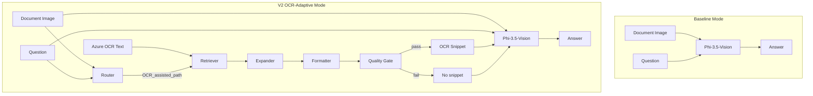
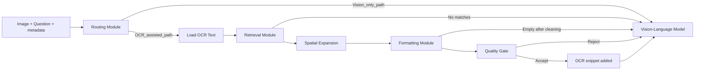
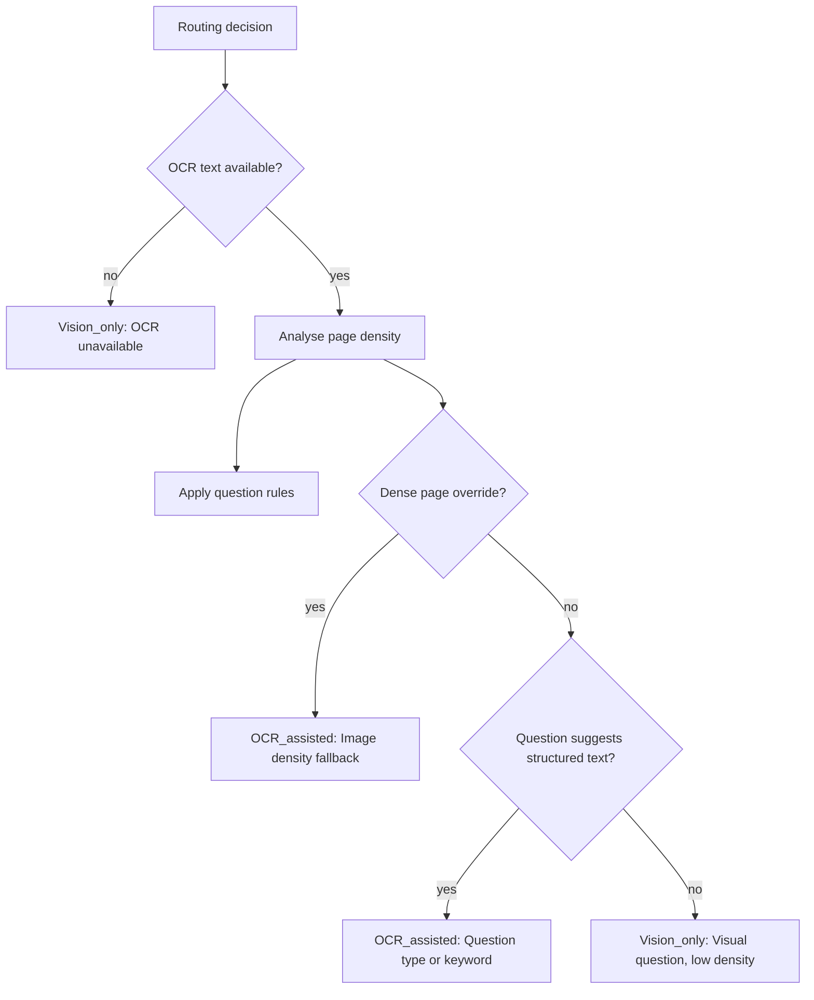
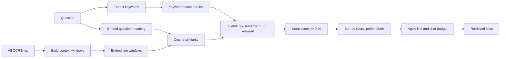
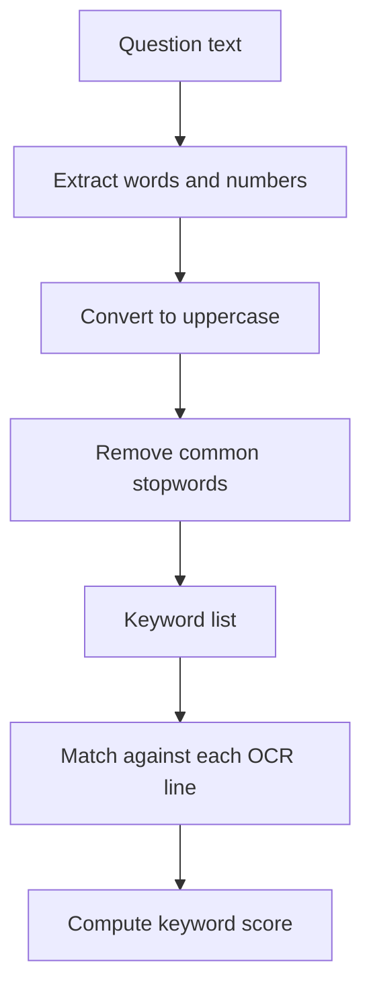
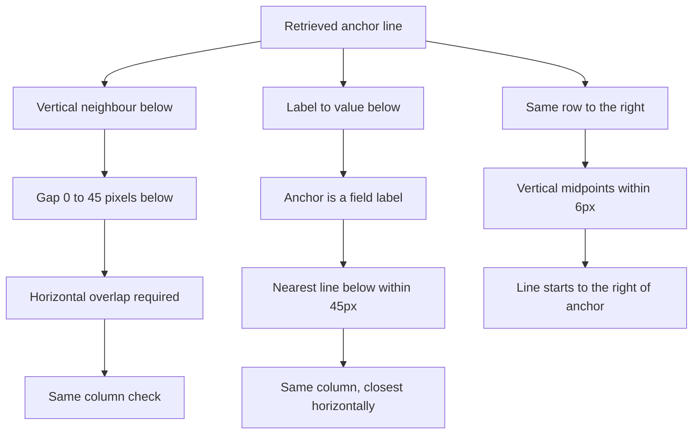
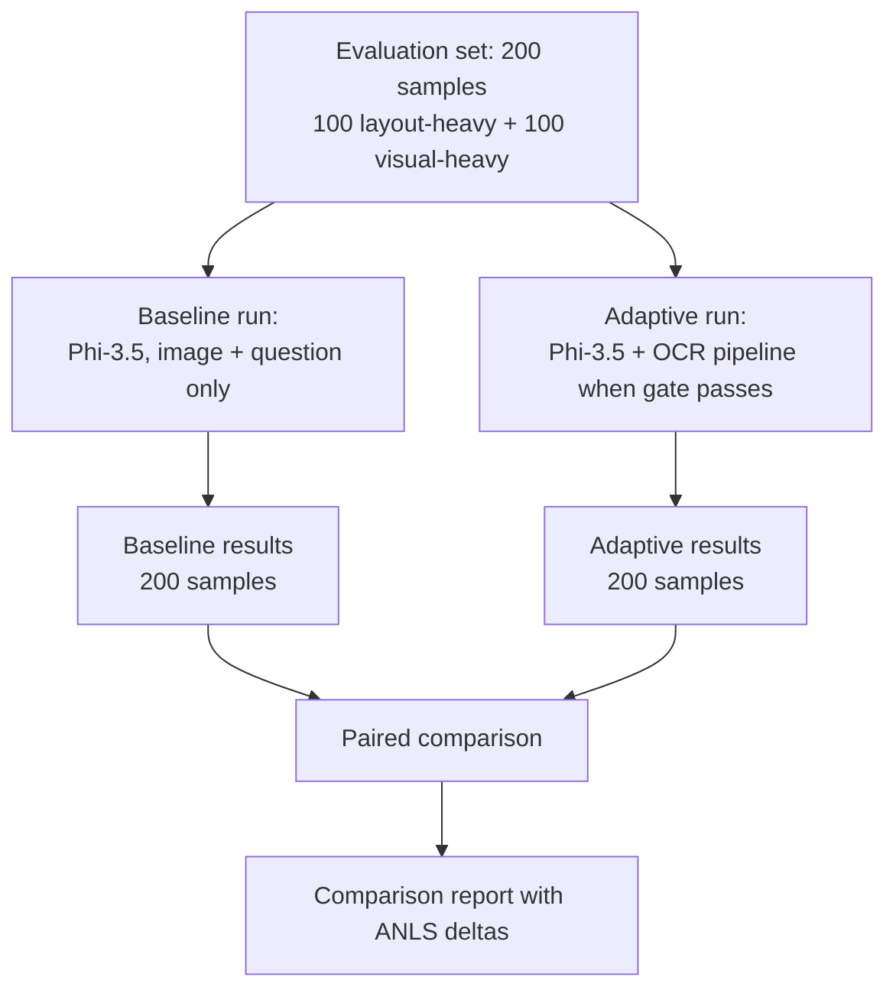

# Document Visual Question Answering: Version 2 OCR-Adaptive Methodology Report

**Document purpose:** This report explains the theoretical design, reasoning, and empirical results of an adaptive OCR-infusion pipeline for Document Visual Question Answering (DocVQA). It is written for examiner review: to show why each design decision was made, how the system behaves in practice, and that the reported accuracy improvement is real and measurable.

**Scope:** Version 2 (V2) of the pipeline only. An earlier version (V1) existed; this report describes the improved V2 design and its evaluation results.

**Base model:** Phi-3.5-Vision (a multimodal vision-language model)  
**Dataset:** SP-DocVQA validation subset (200 stratified samples)  
**OCR source:** Pre-extracted text from Azure Computer Vision

---

## 1. Executive Summary

### 1.1 Problem

When Phi-3.5-Vision is used in zero-shot DocVQA mode, it receives only a document image and a natural-language question. On dense structured documents such as forms, tables, and invoices, the model often:

- Misreads fine print or handwritten digits
- Selects the wrong field when many similar labels exist on the page
- Copies boilerplate text from headers or instruction regions instead of the actual answer

These failures are especially common when the answer depends on precise text in a specific field rather than on general visual understanding of the page.

### 1.2 Proposed Solution

Rather than always injecting OCR text or never using it, the system uses an **adaptive agentic pipeline** that runs before the vision-language model. Five processing stages plus a quality gate decide:

- **Whether** to inject OCR text at all
- **Which lines** from the page are relevant to the question
- **How** to format those lines so the model can use them effectively

The vision-language model always receives the document image. OCR text is added only as optional hints when the pipeline is confident that the retrieved snippet will help. When confidence is insufficient, the system falls back to image-only inference — the same mode as the baseline.

### 1.3 Why an Adaptive Approach

Not every document question benefits from OCR hints. Structured forms and tables gain the most, because answers often correspond to labelled fields with exact text. By contrast, questions about figures, photographs, or yes/no visual judgments may be answered better from the image alone, and injecting irrelevant OCR text can distract or mislead the model.

An adaptive pipeline therefore applies OCR selectively: it activates the text-enhanced path when the question or page characteristics suggest structured text is involved, and it stays on the vision-only path otherwise. A quality gate provides a second layer of safety by rejecting weak OCR snippets even when the router initially chose the OCR-assisted path.

### 1.4 Key Results (V2 vs Baseline)

| Metric | Baseline (vision-only) | V2 OCR-Adaptive | Improvement |
|--------|------------------------|-----------------|-------------|
| Mean ANLS | 0.506 | 0.658 | **+0.152** |
| Exact match rate | 0.420 | 0.595 | +0.175 |
| Layout-heavy cohort ANLS | 0.568 | 0.770 | +0.202 |
| Visual-heavy cohort ANLS | 0.444 | 0.546 | +0.102 |
| Per-sample wins | 6 (baseline) | 46 (adaptive) | 148 ties |

### 1.5 Critical Design Clarification

**The vision-language model always generates the final answer.** The system never returns OCR text directly as the answer. OCR infusion is assistive multimodal fusion: retrieved text with spatial coordinates is appended to the prompt alongside the document image. When the quality gate rejects a snippet, inference falls back to image-only mode — identical to the baseline approach.

---

## 2. System Architecture

### 2.1 Baseline vs Adaptive — High-Level Comparison

The baseline passes the image and question directly to Phi-3.5-Vision. The adaptive system inserts a preprocessing pipeline that may optionally enrich the prompt with OCR hints before the same model generates the answer.



In baseline mode, the model sees only the image and the question. In adaptive mode, the same model may additionally receive a short block of OCR text with bounding-box coordinates, but only when the pipeline determines that the snippet is likely to help.

### 2.2 The Five-Stage Adaptive Pipeline

When the routing module selects the OCR-assisted path, processing proceeds through five stages before the vision-language model is invoked. A quality gate sits at the end and can still reject the OCR snippet, causing a safe fallback to vision-only inference.



The stages are:

1. **Routing module** — decides whether to attempt OCR infusion based on the question and page characteristics
2. **Retrieval module** — selects the most question-relevant OCR lines from the full page
3. **Spatial expansion** — adds neighbouring lines that likely contain the answer value adjacent to a retrieved label
4. **Formatting module** — cleans, orders, and formats lines with coordinates for the prompt
5. **Quality gate** — verifies the snippet is confident and informative before it reaches the model

If any stage fails or the gate rejects the snippet, the system proceeds to the vision-language model without OCR hints — preserving the baseline behaviour as a safe default.

### 2.3 Design Principles

The pipeline was designed around four core principles:

- **Selective OCR:** Text hints are injected only when the question or page suggests they will help; visual-heavy questions default to image-only inference
- **Safe fallback:** At every stage, failure routes back to vision-only mode rather than forcing low-quality OCR into the prompt
- **Image always primary:** The document image is always passed to the model; OCR is supplementary context, not a replacement for vision
- **Bounded prompt size:** Retrieved and expanded text is capped (maximum 25 lines, 1200 characters) to prevent prompt overflow and distraction

### 2.4 Data Inputs

The pipeline consumes four types of input for each question:

| Input | Description |
|-------|-------------|
| Document image | The scanned or photographed page from the SP-DocVQA dataset |
| Question | The natural-language question about the document |
| Question type metadata | Dataset annotation describing the question style (e.g. form, figure/diagram); used during evaluation and optionally at runtime |
| OCR text | Pre-extracted line-level text with bounding-box coordinates from Azure Computer Vision |

Each OCR line consists of the recognized text and a rectangular region on the page `[x1, y1, x2, y2]` indicating where that text appears. These coordinates are essential for spatial expansion and layout-preserving formatting.

---

## 3. Document and Question Classification

Before explaining how the routing module chooses a path, it is important to distinguish two related but separate concepts: **evaluation cohorts** used to analyse results, and **runtime routing decisions** used during inference.

### 3.1 Evaluation Cohorts — Layout-Heavy vs Visual-Heavy

For fair evaluation, the 200-sample test set is divided into two equal groups of 100 questions each. This stratification allows us to measure whether the adaptive pipeline helps structured documents more than visual documents.

| Cohort | How it is determined | Example question types |
|--------|---------------------|------------------------|
| Layout-heavy | Dataset annotation: the question primarily concerns structured text regions on the page | Forms, tables/lists, layout, handwritten fields, miscellaneous structured content |
| Visual-heavy | Dataset annotation: the question concerns figures, photographs, yes/no judgments, or free narrative text | Diagrams, photos, yes/no questions, free text |

**How layout-heavy vs visual-heavy is decided:**

The classification is **not** based on analysing the document image itself (no computer vision classifier labels the page as "form" or "figure"). Instead, it uses **question-type annotations** provided by the SP-DocVQA dataset. Each question in the dataset carries one or more type labels assigned by human annotators. The evaluation script assigns a sample to the layout-heavy cohort if its primary type falls in the structured category (form, table/list, layout, handwritten, others), and to the visual-heavy cohort if its primary type falls in the visual category (figure/diagram, image/photo, yes/no, free text).

**Reasons for this split:**

- Forms and tables benefit most from OCR hints — measuring them separately confirms the pipeline works where intended
- Figure and diagram questions may rely more on visual reasoning — measuring them separately ensures OCR does not harm performance
- A fixed random seed (42) ensures the same 200 questions are selected every time, making results reproducible
- Stratification prevents one question type from dominating the overall average and masking subgroup effects

### 3.2 How Cohort Labels Differ from Runtime Routing

The routing module does **not** read "layout-heavy" or "visual-heavy" labels. Those cohort names exist only for reporting evaluation results after the experiment is complete.

At runtime, the routing module uses three independent signals:

- The **question text** itself (does it mention tables, fields, rows, etc.?)
- **Question type metadata** when available (is it tagged as a form, figure, etc.?)
- **Image pixel analysis** (does the page look text-dense regardless of the question?)

This distinction matters for interpreting results: a question may belong to the visual-heavy evaluation cohort while still receiving OCR hints if its wording or page density triggers the OCR-assisted path. Conversely, a layout-heavy cohort question may fall back to vision-only if retrieval fails or the quality gate rejects the snippet.

---

## 4. Routing Module — Path Selection

The routing module is the first decision point in the adaptive pipeline. Its job is to determine whether the OCR-assisted path is worth attempting, or whether the vision-only path is more appropriate for this particular question and page.

### 4.1 Why Routing Is Needed

Injecting OCR text is not universally beneficial. On structured forms, OCR provides exact field values that the vision model might misread. On pages dominated by figures or photographs, OCR text may be sparse, irrelevant, or misleading. Even on text-heavy pages, a poorly matched OCR snippet can cause the model to copy wrong text instead of reading the image carefully.

Routing therefore acts as a cost-benefit filter: it activates the full OCR pipeline only when there is reasonable evidence that structured text on the page is relevant to the question.

### 4.2 All Routing Outcomes

The system can end up on the vision-only path for several distinct reasons. Each outcome reflects a different stage of the decision process.

#### Outcome 1: Question type or keyword match (primary OCR path)

**When this happens:** The question is classified as concerning structured document content — either through its dataset type label (form, table, layout, handwritten) or through layout-related words in the question text (table, row, column, field, box, total, amount, etc.).

**Reasons for choosing the OCR-assisted path:**

- Form and table questions typically ask for exact text values from labelled fields
- Layout keywords in the question signal that the answer is tied to document structure
- OCR text with spatial coordinates helps the model locate the correct field

**Observed in evaluation:** 84 of 200 samples; mean ANLS 0.756 (the most successful routing category)

#### Outcome 2: Image density fallback (secondary OCR path)

**When this happens:** The question-based rules would select vision-only, but pixel analysis of the page indicates the document is text-dense (many edges, structured layout, or low-contrast scanned text).

**Reasons for overriding to OCR-assisted path:**

- Some form pages are misclassified because the question does not mention "table" or "field" explicitly
- Edge density and contrast analysis detect text-heavy pages without relying on question labels
- Dense scanned forms benefit from OCR even when the question sounds visual

**Observed in evaluation:** 3 of 200 samples; mean ANLS 0.667

#### Outcome 3: Visual question, low density (vision-only at router)

**When this happens:** The question appears to concern visual content (figure, diagram, free text) with no layout keywords, and the page does not appear text-dense on pixel analysis.

**Reasons for choosing vision-only:**

- Figure and diagram questions often require spatial reasoning over the image, not text lookup
- Low edge density suggests the page is not a structured form
- Injecting OCR on such pages adds noise without benefit

**Observed in evaluation:** 96 of 200 samples; mean ANLS 0.568

#### Outcome 4: OCR unavailable (hard fallback)

**When this happens:** No pre-extracted OCR file exists for the document page.

**Reasons for choosing vision-only:**

- Without OCR text, the retrieval and expansion stages cannot run
- The system cannot fabricate text hints; vision-only is the only option

#### Outcome 5: Low retrieval confidence (post-retrieval fallback)

**When this happens:** The router selected the OCR-assisted path, but the quality gate rejected the retrieved snippet because confidence was too low, the snippet added no new information, or it lacked answer-like content.

**Reasons for falling back to vision-only:**

- A weak OCR match is worse than no OCR — it can mislead the model
- The gate threshold (top match score ≥ 0.45) ensures only confident snippets proceed
- Vision-only inference on these samples matched or exceeded baseline performance

**Observed in evaluation:** 11 of 200 samples; mean ANLS 0.701

#### Outcome 6: No lines matched after retrieval (post-retrieval fallback)

**When this happens:** The retrieval module found no OCR lines scoring above the minimum threshold (0.20) for the question.

**Reasons for falling back to vision-only:**

- The question keywords may not appear in the OCR text (OCR errors, unusual wording)
- Forcing empty or random lines into the prompt would not help

**Observed in evaluation:** 6 of 200 samples; mean ANLS 0.647

#### Outcome 7: Sanitizer removed all lines (post-retrieval fallback)

**When this happens:** Retrieved lines existed but were all classified as boilerplate (instruction headers, notices) after cleaning and were removed.

**Reasons for falling back to vision-only:**

- Boilerplate text previously caused the model to copy "INSTRUCTION FOR USER" instead of the actual answer
- An empty snippet after cleaning is equivalent to no useful OCR

### 4.3 Routing Decision Tree



### 4.4 Stage A — Question-Based Rules

The first routing stage examines the question text and its type metadata.

**Prefer the OCR-assisted path when:**

- The question type is form, table/list, layout, handwritten, or similar structured category
- The question text contains layout-related words: table, row, column, field, box, total, amount, sum, left, right, above, below, header, footer

**Prefer vision-only when:**

- The question type is figure/diagram or free text **and** no layout keywords appear in the question wording

**Design rationale:**

- Forms and tables require locating specific labelled fields — OCR text with coordinates directly supports this
- Figure and diagram questions often ask about visual elements (shapes, colours, relationships) that OCR cannot capture
- Cautious types (figure/diagram, free text) still receive OCR if the question explicitly mentions structural concepts like "row" or "field"

### 4.5 Stage B — Image Density Override

If the question-based rules select vision-only, a second check analyses the document image itself using pixel-level features. This catches dense forms that the question wording alone would not trigger.

**How page density is measured:**

- The image is converted to grayscale and optionally resized for efficiency
- Edge density is computed using Canny edge detection — the proportion of pixels identified as edges
- Contrast is measured as the standard deviation of pixel intensities; low values indicate faint or faded scans

**Override to OCR-assisted path when any of these conditions hold:**

- Very high edge density: more than 18% of pixels are edges (typical of dense typed or printed forms)
- Moderate edge density (> 12%) combined with low contrast (faint scans where OCR helps more than vision)
- Low contrast combined with at least moderate edge density (> 8%)

**Design rationale:**

- Some form pages receive visual-heavy question types in the dataset but are actually text-dense documents
- Pixel analysis provides a signal independent of question labels or wording
- This prevents the system from skipping OCR on pages that clearly contain structured text

### 4.6 Observed Routing Distribution (V2 Evaluation, 200 Samples)

| Routing outcome | Plain-language description | Count | Mean ANLS |
|-----------------|---------------------------|-------|-----------|
| Question type or keyword | Primary OCR path — structured question | 84 | 0.756 |
| Visual question, low density | Vision-only at router — visual question on low-text page | 96 | 0.568 |
| Low retrieval confidence | Gate rejected weak snippet | 11 | 0.701 |
| No lines matched | Retrieval found nothing above threshold | 6 | 0.647 |
| Image density fallback | Secondary OCR path — dense page override | 3 | 0.667 |

**Interpretation:** 96 of 200 samples never entered the OCR retrieval path at the router stage. Of the 104 that did, 84 successfully passed all stages and received OCR hints in the model prompt. The remaining 20 fell back to vision-only after retrieval or quality-gate failures — demonstrating that the safety mechanisms activate when needed.

---

## 5. Hybrid Retrieval Module

Once the routing module selects the OCR-assisted path, the retrieval module selects a small subset of OCR lines — typically from 50 to 150 lines on a full page — that are most relevant to the question.

### 5.1 Why Hybrid Retrieval

Two complementary matching strategies are combined because neither alone covers all question styles:

- **Keyword matching** excels when the question mentions an exact field name ("specimen", "college", "date") that appears verbatim in the OCR text
- **Semantic similarity** excels when the question uses different wording from the document ("Which institution?" when the label reads "College:")

Combining both approaches with a weighted blend produces more robust retrieval than either method alone.

### 5.2 Hybrid Scoring Formula

For each OCR line *i* on the page:

```
keyword_score_i  = keyword_match_score(question, line_i.text)
semantic_score_i = cosine_similarity(embed(question), embed(context_window_i))
final_score_i    = 0.7 × semantic_score_i + 0.3 × keyword_score_i
```

| Design parameter | Value | Purpose |
|------------------|-------|---------|
| Semantic weight | 0.7 | Prioritise meaning-based matching |
| Keyword weight | 0.3 | Ensure exact field-name matches are not lost |
| Minimum score to retain | 0.20 | Discard irrelevant lines |
| Candidate pool size | 40 | Top-scoring lines considered before budget |
| Maximum lines in output | 25 | Prevent prompt overflow |
| Maximum characters | 1200 | Character budget including coordinate overhead |

**Selection process:**

1. Score every OCR line on the page; discard lines scoring below 0.20
2. Sort remaining lines by combined score, preferring short field labels when scores tie
3. Select the top 40 lines as candidates
4. Greedily add lines until the line count (25) or character budget (1200) is reached



### 5.3 Semantic Matching — Context Window Embeddings

The semantic path uses a sentence embedding model (MiniLM-L6-v2) to represent the meaning of text as numerical vectors. Rather than embedding each OCR line in isolation, Version 2 embeds a **three-line context window** for each line: the previous line, the current line, and the next line concatenated together.

**Why context windows matter:**

- On forms, the answer value often appears on the line immediately below a label
- Embedding "College: School of Public Health" captures the label-value relationship that isolated line embeddings miss
- Cosine similarity between the question embedding and the window embedding finds semantically related regions even when exact keywords differ

**Scoring:**

```
semantic_score = (question_vector · window_vector) / (||question|| × ||window||)
```

Higher scores indicate stronger semantic alignment between the question and the OCR region.

### 5.4 Keyword Matching — Automatic Extraction

Keywords are **not manually chosen per question**. They are extracted automatically from the question text through a standard pipeline:



**Stopwords removed (18 common words):**

A, AN, AND, ARE, AT, FOR, IN, IS, OF, ON, OR, THE, TO, WAS, WHAT, WHICH, WHO, WHOM

**Examples:**

| Question | Keywords after filtering |
|----------|-------------------------|
| "What is the specimen ?" | SPECIMEN |
| "Which is the college?" | COLLEGE |
| "What is the date on which the request for change was prepared?" | DATE, REQUEST, CHANGE, PREPARED |

**Keyword score computation:**

```
score = (number of matched keywords) / (total keywords)

If any keyword of length 3 or more matches a line → score = 1.0
```

**Match rules:**

- Field-name keywords (COLLEGE, SPECIMEN, DATE, NAME, etc.): matched as whole words only, preventing partial false matches
- Other keywords: matched as substrings within the line text

### 5.5 Version 2 Retrieval Improvements

| Problem in V1 | Design change in V2 | Expected effect |
|---------------|---------------------|-----------------|
| Stopword "THE" matched almost every line | Stopword filter removes common words before matching | Cleaner retrieval pool, fewer false positives |
| Field labels were penalised in scoring | Label penalty removed; labels can rank highly | Labels become anchors for spatial expansion |
| Isolated line embeddings missed adjacent answers | Three-line context windows for embedding | Better semantic matching on label-value pairs |
| Long descriptive lines beat short labels at equal scores | Prefer label lines when scores tie | Correct field labels selected over body text |

---

## 6. Spatial Expansion Module

The retrieval module often finds a field **label** (e.g. "Specimen:") but not the **value** on the line below (e.g. "10 rat sera"). The spatial expansion module uses the geometric layout of text on the page to add neighbouring lines that likely contain the answer.

### 6.1 Why Spatial Expansion Is Needed

On structured forms, answers are typically positioned relative to their labels:

- Below the label in the same column (vertical forms)
- To the right of the label on the same row (horizontal forms)

Keyword and semantic retrieval match the label text well but may miss the value text if it does not contain question keywords. Spatial rules bridge this gap by exploiting the predictable geometry of form layouts.

### 6.2 Spatial Rules

For each retrieved anchor line with bounding box `[x1, y1, x2, y2]`:



| Rule | Geometry | Design parameters |
|------|----------|-------------------|
| Vertical neighbour below | Gap between 0 and 45 pixels below anchor; horizontal overlap | Same-column filter with 20 px padding |
| Label to value below | Anchor is a field label; nearest line below in same column | Sorted by horizontal distance, then vertical distance |
| Same row to the right | Vertical midpoints within 6 px; line begins to the right of anchor | Handles inline form fields |

**Reasons for each rule:**

- **Vertical neighbour:** Most form fields place the value directly below the label; the 45 px gap accommodates typical line spacing
- **Label to value:** When the anchor is identified as a label (ends with colon, or matches a known field name), the nearest value below in the same column is the most likely answer
- **Same row to the right:** Horizontal forms place values inline to the right of labels; the 6 px vertical tolerance handles slight OCR box misalignment
- **Column filter:** Prevents picking up text from adjacent columns in multi-column layouts; 20 px padding allows for minor horizontal drift

**Label detection:**

A line is treated as a field label if any of these hold:

- It matches a "Label:" pattern (e.g. "College:", "Specimen:")
- It ends with a colon and no value on the same line (e.g. "Name: ")
- It is a short line (< 40 characters) starting with a known field name (College, Specimen, Date, etc.)

### 6.3 Post-Expansion Budget and Ordering

After spatial rules add neighbouring lines, a budget step ensures the final snippet stays within limits:

1. **All originally retrieved anchor lines are always kept** — they matched the question directly
2. Expanded neighbour lines are added in order of inherited score until the 25-line or 1200-character limit is reached
3. The final set is sorted by reading order: top-to-bottom, then left-to-right on the page

Expanded lines inherit 90% of their anchor line's score, reflecting that they were not directly matched to the question but are spatially related.

### 6.4 Worked Example — Specimen Question

- **Question:** "What is the specimen ?"
- **What retrieval found:** Lines containing the label "Specimen:" and related field labels
- **What expansion added:** The line below the label containing the value "10 rat sera"
- **Top match confidence:** 0.497 (above the 0.45 gate threshold)
- **Final answer:** "10 rat sera" — ANLS score 1.0 (exact match)

The keyword SPECIMEN matched the label line, but the actual answer text "10 rat sera" appeared on a separate line below. Spatial expansion attached that value line to the snippet, allowing the model to produce the correct answer.

---

## 7. Formatting Module and OCR Prompt Infusion

Once lines are retrieved and expanded, the formatting module prepares them for inclusion in the vision-language model's prompt.

### 7.1 Why Coordinates Are Preserved

Each line is formatted with its bounding-box coordinates alongside the text:

```
[x1,y1,x2,y2] line_text
```

**Reasons for including coordinates:**

- The model receives spatial context about where each text region appears on the page
- Reading order (top-to-bottom, left-to-right) is preserved through coordinate-based sorting
- The model can cross-reference OCR hints with what it sees in the image

### 7.2 Text Cleaning

Before formatting, each line passes through a cleaning step:

- Empty lines are removed
- Boilerplate regions are dropped (instruction headers, notices, user guides) — these previously caused the model to copy "INSTRUCTION FOR USER" instead of the answer
- Double colons (::) are normalised to single colons
- Leading hash marks (#) are stripped — form markers that previously hijacked predictions

Lines that fail cleaning are excluded from the snippet entirely.

### 7.3 Prompt Structure

When the quality gate accepts the OCR snippet, the vision-language model receives a structured prompt:

```
[Image token]
Answer briefly with only the exact value or phrase from the document.
Do not use full sentences.

OCR hints (may be incomplete; prefer the image if hints lack the answer):
[x1,y1,x2,y2] line1
[x1,y1,x2,y2] line2

Question: {question}
```

**Key properties of this prompt design:**

- The document **image is always included** — OCR text is supplementary, not a replacement
- A disclaimer tells the model that OCR may be incomplete and to prefer the image when hints are insufficient
- The instruction requests brief, exact answers — not full sentences — matching DocVQA evaluation conventions
- Generation is limited to 20 tokens with stop conditions on newlines and special markers to prevent runaway output

When the quality gate rejects the snippet, the prompt contains only the image and question — identical to baseline mode.

---

## 8. Quality Gate

The quality gate is the final safety check before OCR text enters the model prompt. Even when the routing module selects the OCR-assisted path and retrieval finds matching lines, the gate can still reject the snippet if it lacks sufficient confidence or informational value.

### 8.1 Why a Quality Gate Is Needed

Routing decides whether OCR *might* help. Retrieval finds candidate lines. But the gate verifies that the assembled snippet is actually *worth injecting*. A weak or uninformative snippet can mislead the model into copying wrong text — performing worse than vision-only inference.

### 8.2 Three Checks (All Must Pass)

**Check 1 — Retrieval confidence**

The highest-scoring retrieved anchor line must score at least **0.45**. This ensures at least one line was confidently matched to the question before any OCR text is injected.

**Check 2 — Information gain**

The OCR snippet must contain words or tokens that are **not already present in the question**. If the snippet merely repeats the question wording without adding answer content, it provides no value and is rejected.

**Check 3 — Answer-like content (for "what is/are" questions)**

When the question asks "what is" or "what are" something, the snippet must contain content that looks like an answer:

- A line with a label-value pattern (e.g. "Specimen: 10 rat sera"), or
- A non-label line with at least two alphanumeric characters

This prevents injecting snippets that contain only question-related labels without actual values.

### 8.3 Gate Failure Behaviour

If any check fails:

- The system falls back to vision-only inference
- No OCR text is included in the prompt
- The model receives the same input as the baseline

**Example — Eastern Airlines question:**

- Question: "What is the name of the issuing airlines?"
- Top retrieval confidence: approximately 0.303 (below the 0.45 threshold)
- Gate decision: rejected — vision-only inference used
- Predicted answer: "Eastern Airlines" — ANLS score 1.0

In this case, injecting low-confidence OCR would likely have hurt accuracy. The gate correctly preserved vision-only performance.

---

## 9. Version 2 Design Improvements

Version 2 addressed specific failure modes discovered during Version 1 evaluation. Each change was driven by observed behaviour rather than arbitrary tuning.

| Problem observed in V1 | Design change in V2 | Expected effect |
|------------------------|---------------------|-----------------|
| Stopword "THE" caused keyword matches on nearly every line | Common stopwords filtered before keyword matching | Cleaner retrieval, fewer false positives |
| Field labels penalised in scoring, preventing expansion | Label penalty removed; labels can rank highly | Label-to-value spatial chains activate correctly |
| Fine-print labels without colons missed (e.g. "College") | Known field names recognised as labels even without punctuation | Form field expansion works on more label styles |
| Multi-column forms picked neighbours from wrong columns | Column overlap filter with horizontal padding | Correct column values retrieved on complex layouts |
| Unbounded expansion overflowed the prompt budget | Expansion budget enforces line and character limits | Stable prompt size, no distraction from excess text |
| Isolated line embeddings missed semantically adjacent answers | Three-line context windows for semantic embedding | Better matching when answers sit next to labels |
| Skewed OCR bounding boxes broke same-row detection | Midpoint-based vertical alignment with 6 px tolerance | Same-row inline fields detected despite OCR imprecision |

---

## 10. Evaluation Methodology

### 10.1 Evaluation Protocol

The adaptive pipeline was evaluated against a vision-only baseline on the same 200 questions using a paired comparison design.



**Procedure:**

1. A stratified subset of 200 questions was selected from the SP-DocVQA validation set (100 layout-heavy, 100 visual-heavy; see Section 3.1)
2. The baseline system ran all 200 questions with image and question only — no OCR hints
3. The V2 adaptive system ran the same 200 questions, applying the full pipeline when routing and the quality gate permitted
4. Per-sample ANLS scores were computed for both runs and compared pairwise

Both runs used the same vision-language model (Phi-3.5-Vision), the same decoding settings, and the same pre-extracted Azure OCR text. The only difference was whether OCR hints were injected into the prompt.

### 10.2 Fairness Controls

- The baseline never receives OCR hints under any condition
- The adaptive system falls back to baseline-equivalent input when the gate rejects a snippet
- The same OCR text is available to both systems (pre-extracted, not generated during evaluation)
- Evaluation was run in fixed-size chunks with resume capability to prevent partial-run bias
- A fixed random seed (42) ensures the same 200 questions are selected reproducibly

### 10.3 Hardware

Evaluation was conducted on a GPU environment (Kaggle T4) with Phi-3.5-Vision in half-precision floating point. Semantic retrieval used the MiniLM sentence embedding model.

---

## 11. ANLS Metric

### 11.1 Purpose

ANLS (Average Normalized Levenshtein Similarity) is the standard evaluation metric for DocVQA. It measures how closely the predicted answer matches the ground truth, rewarding near-matches and penalising completely wrong answers.

Unlike exact match (which requires character-perfect agreement), ANLS gives partial credit when the prediction is close to the correct answer — important for answers with minor OCR or formatting differences.

### 11.2 Per-Sample ANLS Formula

For a prediction *p* and each ground-truth answer *g*:

**Step 1 — Normalise both strings:**

- Convert to lowercase
- Remove articles (a, an, the)
- Remove punctuation
- Collapse whitespace

**Step 2 — Compute normalised similarity:**

```
similarity(p, g) = 1 − edit_distance(p, g) / max(length(p), length(g))
```

**Step 3 — Apply threshold:**

```
If similarity < 0.5  →  ANLS = 0
If similarity ≥ 0.5  →  ANLS = (similarity − 0.5) / (1 − 0.5)
```

**Step 4 — Multiple ground truths:**

When multiple acceptable answers exist, the highest ANLS among all ground truths is used.

### 11.3 Dataset-Level Metrics

```
Mean ANLS = average of per-sample ANLS over all 200 samples
Exact match rate = proportion of samples where normalised prediction equals normalised ground truth
```

### 11.4 Worked Examples

| Prediction | Ground truth | Similarity | ANLS |
|------------|--------------|------------|------|
| "10 rat sera" | "10 rat sera" | 1.0 | **1.0** |
| "JOHN SMITH" | "John Smith" | 1.0 | **1.0** |
| "8/25/86" | "8/25/88" | ~0.86 | **0.72** |
| "8/25/15" | "8/25/88" | ~0.71 | **0.43** |
| "xyz" | "abc" | low | **0.0** |

ANLS rewards near-matches above 50% character similarity and assigns zero to poor matches. This makes it more informative than exact match alone for document QA, where minor formatting differences are common.

---

## 12. Results and Evidence of Improvement

### 12.1 Overall Performance

| Metric | Baseline | V2 Adaptive |
|--------|----------|-------------|
| Mean ANLS | 0.506 | **0.658** |
| Exact match | 0.420 | **0.595** |
| Samples | 200 | 200 |

**Absolute improvement: +0.152 mean ANLS (approximately 30% relative improvement).**

### 12.2 By Evaluation Cohort

| Cohort | Baseline ANLS | V2 ANLS | Improvement |
|--------|---------------|---------|-------------|
| Layout-heavy (n=100) | 0.568 | 0.770 | **+0.202** |
| Visual-heavy (n=100) | 0.444 | 0.546 | **+0.102** |

The largest gains appear on layout-heavy documents — forms, tables, and structured fields — where OCR infusion directly targets the question style. Visual-heavy documents also improve, but by a smaller margin, consistent with the design expectation that OCR helps most on structured text.

### 12.3 By Question Type

| Question type | Baseline | V2 | Improvement |
|---------------|----------|-----|-------------|
| Form | 0.603 | 0.790 | +0.187 |
| Table/list | 0.376 | 0.771 | +0.395 |
| Layout | 0.571 | 0.800 | +0.229 |
| Handwritten | 0.521 | 0.683 | +0.162 |
| Figure/diagram | 0.435 | 0.584 | +0.149 |
| Free text | 0.457 | 0.554 | +0.097 |

Table/list questions show the largest improvement (+0.395), confirming that OCR hints are especially valuable when answers are embedded in tabular structure.

### 12.4 Per-Sample Win/Tie Analysis

| Outcome | Count |
|---------|-------|
| V2 adaptive wins (higher ANLS) | 46 |
| Baseline wins | 6 |
| Tie (identical ANLS) | 148 |

Adaptive wins outnumber baseline wins by **46 to 6**, demonstrating that improvement is distributed across many samples rather than driven by a handful of outliers. The 148 ties indicate that on many questions both approaches produce the same answer — improvement is concentrated where OCR genuinely helps.

### 12.5 Success Case — Specimen Question

- **Question:** "What is the specimen ?"
- **Routing decision:** OCR-assisted path (question type indicates a form field)
- **Pipeline behaviour:** Retrieval matched the "Specimen:" label; spatial expansion added the value line "10 rat sera"
- **OCR hints used:** Yes
- **Predicted answer:** "10 rat sera"
- **ANLS score:** 1.0 (exact match)

This case demonstrates the full pipeline working as designed: routing recognises a form question, retrieval finds the label, expansion attaches the value, the gate accepts the confident snippet, and the model produces the correct answer.

### 12.6 Honest Failure Case — Date Question

- **Question:** "What is the date on which the request for change was prepared?"
- **Ground truth:** "8/25/88"
- **Baseline (vision only):** "8/25/86" — ANLS approximately 0.72
- **V2 adaptive (OCR hints used):** "8/25/15" — ANLS approximately 0.43

In this case, Azure OCR misread the handwritten year on the form. The vision-language model copied the incorrect OCR text from the snippet instead of correcting it from the image. This demonstrates three important points:

1. The model **is** being used to generate the answer — it is not simply returning OCR text
2. OCR infusion can **hurt** accuracy when the underlying OCR contains errors
3. The quality gate checks retrieval confidence, not OCR correctness against ground truth (ground truth is unavailable at inference time)

This failure mode is a known limitation and motivates future work on OCR error detection within the pipeline.

---

## 13. Summary of Design Decisions

| Design decision | Rationale |
|-----------------|-----------|
| Adaptive routing | OCR helps structured forms but is not always needed; routing avoids injecting irrelevant text |
| Hybrid retrieval (keywords + semantics) | Exact field names and paraphrased questions require different matching strategies |
| Spatial expansion | Form answers are geometrically adjacent to their labels; retrieval alone often finds only the label |
| Quality gate | Prevents low-confidence OCR snippets from misleading the model; safe fallback to vision-only |
| Vision-language model always generates answers | Preserves multimodal reasoning; OCR provides hints, not direct answers |
| Bounded prompt size | Prevents prompt overflow and distraction from excess OCR text |
| Evaluation cohort stratification | Separates layout-heavy and visual-heavy performance to verify the pipeline helps where intended |

---

## 14. Limitations and Future Work

Several limitations should be acknowledged when interpreting these results:

- **Cohort labels come from dataset annotations**, not automatic image classification. In a production setting without question-type metadata, the routing module must rely on question keywords and image density analysis alone.
- **OCR quality sets a performance ceiling.** When Azure OCR misreads text (especially handwriting), the model may copy errors from the snippet. The quality gate checks match confidence, not factual correctness.
- **Many samples are unchanged.** 148 of 200 samples tied between baseline and adaptive, indicating improvement is concentrated on questions where OCR genuinely helps rather than being universal.
- **No model fine-tuning was performed.** Phi-3.5-Vision weights are frozen; all gains come from inference-time retrieval and prompt engineering.
- **Production deployment** would require handling cases where question-type metadata is unavailable, potentially relying more heavily on keyword extraction and image density analysis.

Future work could explore OCR error detection within the pipeline, adaptive weighting of semantic vs keyword scores based on question type, and fine-tuning the vision-language model on OCR-augmented prompts.

---

## References

- SP-DocVQA dataset and ANLS metric: standard DocVQA evaluation protocol (Mathew et al.)
- Phi-3.5-Vision: Microsoft multimodal instruction-tuned model
- Sentence embeddings: all-MiniLM-L6-v2 (Reimers & Gurevych)
- Azure Computer Vision OCR: pre-extracted text for SP-DocVQA documents

---

## Optional Appendix: Implementation Mapping (For Developers)

*This section is optional when copying to Word. It maps report concepts to repository files for verification purposes.*

| Report concept | Repository location |
|----------------|---------------------|
| Pipeline orchestration | `src/agents/pipeline.py` |
| Routing module | `src/agents/router_agent.py` |
| Image density analysis | `src/agents/image_density.py` |
| Hybrid retrieval | `src/agents/retriever_agent.py` |
| Spatial expansion | `src/agents/context_expander.py` |
| Formatting and cleaning | `src/agents/formatter_agent.py`, `src/agents/text_sanitizer.py` |
| Quality gate | `src/agents/quality_gate.py` |
| Vision-language inference | `src/models/inference.py` |
| OCR loading | `src/data/ocr_loader.py` |
| ANLS metric | `src/utils/metrics.py` |
| Configuration constants | `config/settings.py` |
| Evaluation subset builder | `scripts/build_eval_subset.py` |
| Chunked evaluation | `scripts/chunked_evaluation.py` |
| Baseline comparison | `scripts/compare_baselines.py` |

| Design parameter | Value |
|------------------|-------|
| Semantic/keyword blend weight | 0.7 / 0.3 |
| Retrieval minimum score | 0.20 |
| Quality gate minimum score | 0.45 |
| Maximum snippet lines | 25 |
| Maximum snippet characters | 1200 |
| Vertical expansion gap | 45 pixels |
| Column padding | 20 pixels |
| Same-row alignment tolerance | 6 pixels |
| ANLS zero threshold | 0.5 |
| Maximum answer tokens | 20 |

---

*Report for VisionDocPhi-3.5 Version 2 OCR-Adaptive Pipeline. Evaluation: 200 paired samples, baseline vs adaptive comparison.*
